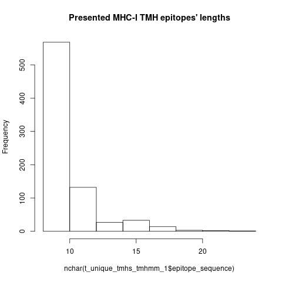

# bbbq_article_issue_183

BBBQ article issue 183.

## Results

 * [all epitopes](all.csv)
 * [only TMH-derived epitopes](tmh.csv)

## Histograms of epitope lengths




## Script

 * [R script](do_it.R)

## How were the CSV files obtained?

```
cp ../bbbq_article_issue_157/matches_1.csv .
cp ../bbbq_article_issue_157/tmhs_tmhmm_1.csv .
```


